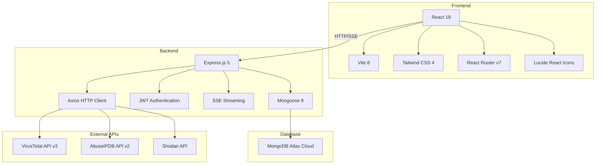
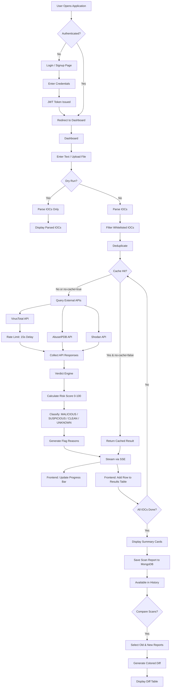
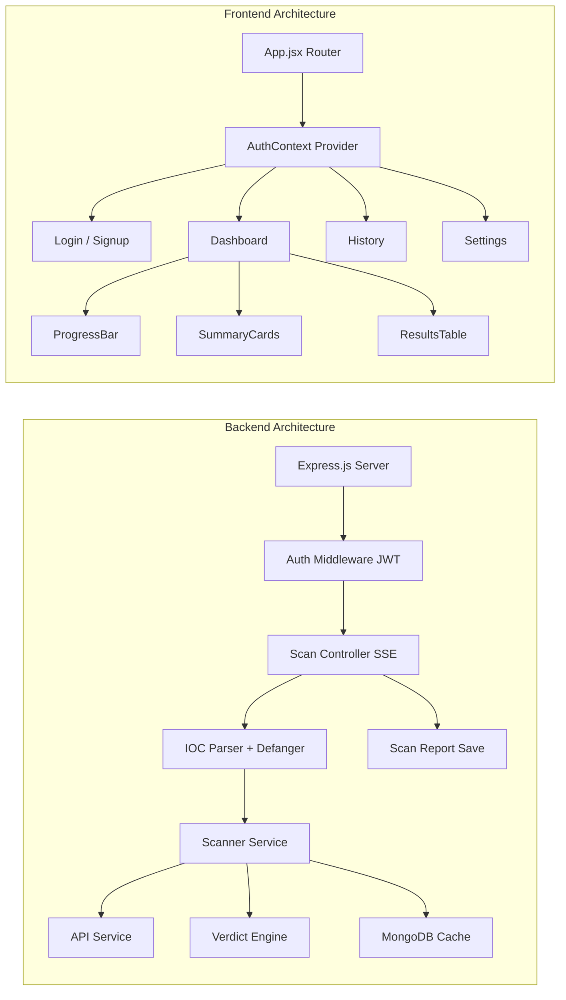

# NEXUS SCANNER — IOC Threat Intelligence Dashboard

## Project Report

---

# CHAPTER 1: INTRODUCTION

### 1.1 Background

In the modern cybersecurity landscape, organizations face an ever-growing volume of threats from malicious actors. Security analysts regularly encounter Indicators of Compromise (IOCs) — artifacts such as IP addresses, domain names, file hashes, and URLs — that signal potential security breaches. Manually investigating each IOC across multiple threat intelligence platforms is time-consuming, error-prone, and inefficient.

The need for automated, centralized IOC analysis tools has become critical as threat landscapes evolve. Security Operations Centers (SOCs) process thousands of IOCs daily, requiring rapid enrichment from multiple intelligence sources to make informed decisions about potential threats.

### 1.2 Problem Statement

Security analysts currently face the following challenges:

1. **Manual Cross-referencing**: Analysts must individually query each IOC across multiple threat intelligence platforms (VirusTotal, AbuseIPDB, Shodan), which is slow and tedious.
2. **Rate Limit Management**: Free-tier API keys impose strict rate limits (e.g., VirusTotal allows only 4 requests per minute), making bulk analysis difficult without automation.
3. **Lack of Unified Verdict**: Different platforms report threat data in incompatible formats, requiring analysts to mentally synthesize results into a single risk assessment.
4. **No Historical Tracking**: Without persistent scan history, analysts cannot track how the threat posture of an IOC changes over time.
5. **Shared API Quotas**: In team environments, shared API keys lead to quota exhaustion and broken workflows.

### 1.3 Proposed Solution

**Nexus Scanner** is a full-stack web application designed to automate IOC threat intelligence analysis. Built on the MERN stack (MongoDB, Express.js, React, Node.js), it provides:

- Automated IOC extraction and classification from raw text or uploaded files
- Concurrent enrichment from VirusTotal, AbuseIPDB, and Shodan APIs
- A weighted verdict engine producing unified risk scores (0–100)
- Real-time streaming of scan results via Server-Sent Events (SSE)
- Per-user API key management to isolate rate limit quotas
- Persistent scan history with colored diff comparison between runs
- Export capabilities in JSON and CSV formats

### 1.4 Objectives

1. To develop a web-based IOC scanner that automatically identifies and classifies indicators from unstructured text.
2. To integrate multiple threat intelligence APIs and synthesize their results into a unified risk verdict.
3. To implement real-time progress streaming for a responsive user experience.
4. To provide scan history with diff capability for tracking IOC reputation changes over time.
5. To deliver a production-quality, dark-themed UI with glassmorphism aesthetics.

---

# CHAPTER 2: PROJECT SCOPE

### 2.1 In Scope

The following features are within the scope of this project:

| Module | Features |
|--------|----------|
| **Input & Parsing** | Text input, file upload (.txt, .csv), auto-detection of IOC types (IPv4, MD5, SHA1, SHA256, domain), defanging support (hxxp, [.], [:]), deduplication |
| **Threat Intelligence** | VirusTotal (hash/IP/domain lookup), AbuseIPDB (abuse confidence, reports, country), Shodan (open ports, services, OS, geolocation) |
| **Verdict Engine** | Weighted risk scoring (0–100), final verdict classification (MALICIOUS/SUSPICIOUS/CLEAN/UNKNOWN), flag reasons |
| **Enrichment** | Reverse DNS for IPs, ASN/Org from Shodan, geolocation from AbuseIPDB, country codes |
| **Caching** | MongoDB-based cache with 24-hour TTL, no-cache flag, cache clear command |
| **Authentication** | User registration, JWT-based login, per-user API key storage |
| **Dashboard** | Live progress bar with SSE, real-time result streaming, summary stats cards |
| **History** | Persistent scan reports, detailed report viewer, colored diff between scan runs |
| **Export** | JSON export, CSV export |
| **Settings** | API key management, IOC whitelist management |

### 2.2 Out of Scope

The following are explicitly excluded from the current version:

- URL-specific scanning (URL submission to VirusTotal sandbox)
- HTML report generation with charts
- Email verification for user registration
- Role-based access control (admin vs. user)
- CLI interface (the project focuses on the web dashboard)
- Real-time alerting and notification systems
- Integration with SIEM platforms

### 2.3 Target Users

- **Security Analysts** performing threat investigations
- **SOC Teams** triaging alerts and enriching indicators
- **Incident Responders** analyzing compromise indicators during active investigations
- **Cybersecurity Students** learning threat intelligence workflows

---

# CHAPTER 3: SOFTWARE AND HARDWARE REQUIREMENTS

### 3.1 Software Requirements

| Category | Requirement | Version |
|----------|-------------|---------|
| **Runtime** | Node.js | v18+ |
| **Package Manager** | npm | v9+ |
| **Database** | MongoDB Atlas (Cloud) | v7+ |
| **Backend Framework** | Express.js | v5.2.1 |
| **ODM** | Mongoose | v9.5.0 |
| **Frontend Framework** | React | v19.2.5 |
| **Build Tool** | Vite | v8.0.10 |
| **CSS Framework** | Tailwind CSS | v4.2.4 |
| **Authentication** | JSON Web Tokens (JWT) | — |
| **Password Hashing** | bcryptjs | — |
| **HTTP Client** | Axios | v1.15.2 |
| **Operating System** | Windows 10/11, macOS, or Linux | — |
| **Browser** | Chrome, Firefox, Edge (modern) | — |

### 3.2 Hardware Requirements

| Component | Minimum | Recommended |
|-----------|---------|-------------|
| **Processor** | Dual-core 2.0 GHz | Quad-core 2.5 GHz+ |
| **RAM** | 4 GB | 8 GB+ |
| **Storage** | 500 MB (for project files) | 1 GB+ |
| **Network** | Broadband Internet (for API calls and MongoDB Atlas) | Stable broadband |
| **Display** | 1280×720 | 1920×1080 |

### 3.3 External API Requirements

| API | Purpose | Rate Limit (Free Tier) | Key Required |
|-----|---------|----------------------|--------------|
| **VirusTotal API v3** | File hash, IP, domain reputation | 4 requests/minute | Yes |
| **AbuseIPDB API v2** | IP abuse confidence scoring | 1000 requests/day | Yes |
| **Shodan API** | Port scanning, service detection | 1 request/second | Yes |

---

# CHAPTER 4: TOOL / TECHNOLOGY / APPROACH

### 4.1 Technology Stack



### 4.2 Architecture — MERN Stack

The project follows a **three-tier architecture**:

1. **Presentation Tier (React Frontend)**: Single Page Application (SPA) built with React 19 and Vite. Handles user interactions, SSE event consumption, and data visualization. Styled with Tailwind CSS v4 using a dark glassmorphism design system.

2. **Application Tier (Express Backend)**: RESTful API server built with Express.js 5. Handles authentication, IOC parsing, API orchestration with rate limiting, verdict calculation, SSE streaming, and scan history management.

3. **Data Tier (MongoDB Atlas)**: Cloud-hosted NoSQL database storing user accounts, API keys, scan reports, IOC cache (with TTL), and whitelist entries.

### 4.3 Key Design Decisions

| Decision | Rationale |
|----------|-----------|
| **MongoDB over SQLite** | Already in a JavaScript stack; Mongoose ODM provides schema flexibility for Mixed-type API responses |
| **SSE over WebSockets** | One-way server-to-client streaming is sufficient; SSE is simpler, auto-reconnects, and works over HTTP |
| **Per-user API keys** | Isolates rate limit quotas; prevents one user from burning another's credits |
| **Frontend file extraction** | Files are read client-side and sent as text strings — reduces server load, simpler debugging |
| **Weighted Verdict Engine** | Different APIs have different reliability levels; weighted scoring produces more accurate risk assessments |

### 4.4 Security Approach

- **Password Hashing**: bcrypt with 10 salt rounds
- **JWT Tokens**: 30-day expiry, signed with server-side secret
- **API Key Storage**: Stored encrypted in user profile in MongoDB
- **CORS**: Configured to allow cross-origin requests from the frontend
- **Input Sanitization**: IOC text is parsed through regex extraction, not evaluated

---

# CHAPTER 5: PROJECT PLAN

### 5.1 List of Major Activities / Implemented Features

---

#### 5.1.1 User Authentication System

The application implements a complete JWT-based authentication system. Users register with an email and password. Passwords are hashed using bcrypt before storage. On login, the server issues a JSON Web Token valid for 30 days. The frontend stores this token in localStorage and attaches it to all API requests via the `Authorization: Bearer <token>` header.

**Key files**: `models/user.js`, `controllers/authController.js`, `routes/authRoutes.js`, `utils/authMid.js`

**Flow**:
1. User submits email + password on the Signup page
2. Backend hashes password with bcrypt, creates user document in MongoDB
3. Returns JWT token
4. Frontend stores token and redirects to Dashboard

---

#### 5.1.2 IOC Parsing Engine

The parser automatically extracts Indicators of Compromise from raw, unstructured text. It supports:

- **IPv4 addresses**: Regex-based extraction with validation (0–255 octets)
- **MD5 hashes**: 32-character hex strings
- **SHA1 hashes**: 40-character hex strings
- **SHA256 hashes**: 64-character hex strings
- **Domains**: Multi-label domain names with TLD validation
- **Defanging**: Automatically converts `hxxp` → `http`, `[.]` → `.`, `[:]` → `:`
- **Deduplication**: Uses JavaScript Sets to eliminate duplicate IOCs
- **Whitelist filtering**: Queries user's whitelist from MongoDB and removes matching IOCs before scanning

**Key file**: `utils/parser.js`

---

#### 5.1.3 Threat Intelligence API Integration

The application integrates three major threat intelligence APIs:

**VirusTotal API v3**:
- Hash lookup: detection ratio, malware family identification
- IP lookup: detection engines, associated domains, country
- Domain lookup: detection engines, DNS records, categories
- Returns: malicious/suspicious/harmless/undetected counts

**AbuseIPDB API v2**:
- Abuse confidence score (0–100%)
- Total reports count
- Country code, ISP, domain information
- Returns: confidence score, report count, geolocation

**Shodan API**:
- Open ports list
- Operating system detection
- ISP and organization name
- Returns: ports array, OS, ISP, org

Each API uses the **user's personal API key** (stored in their profile), falling back to environment variable keys if the user hasn't configured their own.

**Key file**: `services/apis.js`

---

#### 5.1.4 Verdict Engine

The Verdict Engine synthesizes results from all three APIs into a single risk assessment. It uses a weighted scoring algorithm:

| Source | Scoring Rule | Max Contribution |
|--------|-------------|-----------------|
| **VirusTotal** | +5 points per malicious engine detection | Uncapped (normalized to 100) |
| **AbuseIPDB** | confidence_score × 0.5 | 50 points |
| **Shodan** | +5 points per dangerous port (21, 22, 23, 445, 3389, 4444) | Variable |

**Final Verdict Classification**:
| Risk Score | Verdict |
|-----------|---------|
| 0 (with data) | CLEAN |
| 1–39 | SUSPICIOUS |
| 40–100 | MALICIOUS |
| 0 (no data) | UNKNOWN |

Each verdict includes **flag reasons** — human-readable strings explaining what triggered the score (e.g., "VT: 18 engines detected", "AbuseIPDB: 94% confidence", "Shodan: Dangerous ports open [4444,3389]").

**Key file**: `services/verdictEngine.js`

---

#### 5.1.5 Rate Limiting & Reliability

The scanner respects API rate limits through built-in delays:

- **VirusTotal**: 15-second delay between requests (enforcing 4 req/min limit)
- **AbuseIPDB**: Sequential processing prevents burst requests
- **Shodan**: Concurrent with AbuseIPDB per IOC

Error handling includes:
- HTTP 404: Graceful "Not found" response
- HTTP 429: "Rate limited" status returned
- HTTP 403: "Access denied" for invalid keys
- Network errors: Error message captured and returned

**Key file**: `services/scanner.js`

---

#### 5.1.6 MongoDB Caching

The application implements a MongoDB-based cache to reduce redundant API calls:

- **TTL**: 24-hour expiry (configurable)
- **Key**: IOC value + IOC type (compound)
- **Upsert**: Cache entries are updated on subsequent scans
- **No-cache flag**: Users can bypass the cache for fresh results
- **Clear cache**: Admin endpoint to flush all cached entries

Cache hit/miss is transparent — cached results are served instantly without API calls.

**Key files**: `models/scan.js`, `services/scanner.js`

---

#### 5.1.7 Real-Time SSE Streaming & Progress Bar

Instead of waiting for all IOCs to complete before showing results, the application uses **Server-Sent Events (SSE)** to stream results in real-time:

**SSE Event Types**:
```json
{ "type": "start", "total": 10 }
{ "type": "progress", "current": 3, "total": 10, "ioc": "45.33.32.156", "status": "scanning" }
{ "type": "result", "current": 3, "total": 10, "ioc": "45.33.32.156", "status": "done", "result": {...} }
{ "type": "done", "summary": { "total": 10, "malicious": 2, "suspicious": 1, "clean": 7 } }
```

The frontend consumes these events and renders:
- An animated progress bar with current/total count and percentage
- The IOC currently being scanned
- Results streaming into the table as they complete

**Key files**: `controllers/scanController.js`, `components/ProgressBar.jsx`

---

#### 5.1.8 Dashboard — Summary Stats Cards

After a scan completes, a row of four at-a-glance summary cards appears:

| Card | Color | Content |
|------|-------|---------|
| Total Scanned | Blue | Count of all IOCs processed |
| Malicious | Red | Count with MALICIOUS verdict |
| Suspicious | Yellow | Count with SUSPICIOUS verdict |
| Clean | Green | Count with CLEAN verdict |

**Key file**: `components/SummaryCards.jsx`

---

#### 5.1.9 Results Table with Verdict Badges

The results table displays all scanned IOCs with:

- **Indicator**: The IOC value (font-mono for readability)
- **Type**: Badge showing IP/HASH/DOMAIN
- **Verdict**: Color-coded badge (red for MALICIOUS, yellow for SUSPICIOUS, green for CLEAN, gray for UNKNOWN)
- **Risk Score**: Visual bar (0–100) with color gradient
- **VirusTotal**: Detection ratio (e.g., "18/72")
- **AbuseIPDB**: Confidence percentage
- **Shodan**: Open ports as badges
- **Flags**: Human-readable reason tags
- **Link**: Direct link to VirusTotal report

**Key file**: `components/ResultsTable.jsx`

---

#### 5.1.10 File Upload Support

Users can upload `.txt`, `.csv`, or `.log` files directly from the Dashboard. The file is read on the client side using the `FileReader` API, and its text content is appended to the input textarea. This approach:

- Reduces server bandwidth usage
- Simplifies debugging (no multipart form handling)
- Allows users to review/edit extracted text before scanning

---

#### 5.1.11 Dry Run Mode

The dry-run feature parses the input text and returns all extracted IOCs **without making any API calls**. This is useful for:

- Previewing what will be scanned before burning API quota
- Validating that the parser correctly identifies IOCs from complex text
- Testing the defanging engine

The dry-run response displays IOCs as labeled badges showing their detected type.

---

#### 5.1.12 Scan History & Persistence

Every completed scan is saved as a `ScanReport` document in MongoDB, linked to the authenticated user. The History page displays:

- Chronological list of past scans
- Date/time of each scan
- Quick summary badges (X malicious, Y suspicious, Z clean)
- Clicking a report opens a detailed view with full results table and summary stats

**Key files**: `models/scanReport.js`, `pages/History.jsx`

---

#### 5.1.13 Colored Diff Between Scans

The standout feature — users can compare two scan reports side by side:

1. Click **"Compare Scans"** button
2. Select the OLDER scan
3. Select the NEWER scan
4. A diff table appears showing:

| Diff Status | Color | Meaning |
|-------------|-------|---------|
| **NEW** | Blue | IOC not present in the old scan |
| **CHANGED** | Yellow | Verdict or risk score changed between scans |
| **UNCHANGED** | Gray | No change detected |
| **REMOVED** | Red | IOC was in old scan but not in new scan |

Changed IOCs show previous verdict/risk score with strikethrough next to the new values.

**Key files**: `controllers/scanController.js` (diffReports), `pages/History.jsx`

---

#### 5.1.14 Settings — Per-User API Key Management

Each user stores their own API keys for VirusTotal, AbuseIPDB, and Shodan. This ensures:

- Rate limit quotas are per-user, not shared
- Users can upgrade their API tier independently
- Keys are stored securely in MongoDB (password-type input fields)

**Key file**: `pages/Settings.jsx`

---

#### 5.1.15 Whitelist Management

Users can maintain a whitelist of known-safe IOCs (their own IPs, internal domains, etc.). Whitelisted IOCs are automatically filtered out during the parsing phase, before any API calls are made.

The Settings page provides full CRUD operations:
- Add IOCs with type selection (IP/Domain/Hash)
- View all whitelisted entries
- Remove entries with a single click

**Key files**: `models/whitelist.js`, `controllers/whitelistController.js`, `pages/Settings.jsx`

---

#### 5.1.16 Export Functionality

Scan results can be exported in two formats:

- **JSON**: Full structured data including all API responses, verdicts, and flag reasons
- **CSV**: Tabular format with columns: IOC, Type, Verdict, Risk Score, Flag Reasons

Export buttons appear in the scan results section after a scan completes.

---

#### 5.1.17 Enrichment (No Extra API Needed)

The scanner performs additional enrichment using built-in capabilities:

- **Reverse DNS**: Uses Node.js `dns.reverse()` to resolve IP addresses to hostnames
- **ASN & Organization**: Extracted from Shodan response
- **ISP Information**: Extracted from Shodan response
- **OS Detection**: Extracted from Shodan response
- **Country/Geolocation**: Extracted from AbuseIPDB response

---

# CHAPTER 6: FLOWCHART OF IMPLEMENTATION





---

# CHAPTER 7: CONCLUSION AND FUTURE WORK

### 7.1 Conclusion

Nexus Scanner successfully addresses the core challenges faced by security analysts in IOC investigation. The application automates the tedious process of cross-referencing indicators across multiple threat intelligence platforms, providing a unified risk assessment through its weighted verdict engine.

Key accomplishments of this project include:

1. **Automated IOC Extraction**: The regex-based parser with defanging support reliably extracts indicators from arbitrary text, reducing manual effort significantly.

2. **Unified Threat Assessment**: The weighted verdict engine synthesizes data from VirusTotal, AbuseIPDB, and Shodan into a single 0–100 risk score with clear verdict classification, eliminating the need for analysts to mentally correlate data from multiple sources.

3. **Real-Time User Experience**: Server-Sent Events enable a responsive, live-updating interface where analysts see results as they arrive rather than waiting for entire batch completion.

4. **Operational Efficiency**: MongoDB caching with 24-hour TTL reduces redundant API calls, while per-user API key management prevents quota conflicts in multi-user environments.

5. **Historical Analytics**: The scan history with colored diff comparison provides a unique capability for tracking how IOC reputations change over time — a feature rarely found in free-tier tools.

6. **Production-Quality UI**: The dark glassmorphism design with Inter typography, gradient accents, and micro-animations delivers a premium, professional interface befitting enterprise security tooling.

The MERN stack proved to be an excellent choice for this project, providing a cohesive JavaScript ecosystem from database to frontend, with Mongoose offering the schema flexibility needed for heterogeneous API responses.

### 7.2 Future Work

The following enhancements are planned for future iterations:

| Priority | Feature | Description |
|----------|---------|-------------|
| **High** | HTML Report Generation | Sortable tables, verdict badges, and summary charts in a shareable HTML file |
| **High** | URL Scanning | Submit URLs to VirusTotal's URL scanner for redirect chain analysis |
| **Medium** | Role-Based Access Control | Admin and analyst roles with permission-based feature access |
| **Medium** | Email Notifications | Alert users when a previously-clean IOC turns malicious |
| **Medium** | MITRE ATT&CK Mapping | Map IOCs to ATT&CK techniques based on Shodan services and VT malware families |
| **Low** | STIX/TAXII Integration | Export IOCs in STIX format for SIEM ingestion |
| **Low** | Dark Web Monitoring | Integrate with dark web intelligence feeds for leaked credential detection |
| **Low** | Browser Extension | One-click IOC scanning from any webpage |
| **Low** | CLI Tool | Command-line interface for automation and scripting use cases |

---

# CHAPTER 8: REFERENCES

1. **VirusTotal API v3 Documentation**
   https://docs.virustotal.com/reference/overview

2. **AbuseIPDB API v2 Documentation**
   https://docs.abuseipdb.com/

3. **Shodan API Documentation**
   https://developer.shodan.io/api

4. **MongoDB Atlas Documentation**
   https://www.mongodb.com/docs/atlas/

5. **Express.js 5.x Documentation**
   https://expressjs.com/en/5x/api.html

6. **React 19 Documentation**
   https://react.dev/

7. **Vite Build Tool Documentation**
   https://vite.dev/

8. **Tailwind CSS v4 Documentation**
   https://tailwindcss.com/docs

9. **JSON Web Tokens (JWT) Specification — RFC 7519**
   https://datatracker.ietf.org/doc/html/rfc7519

10. **Server-Sent Events (SSE) — MDN Web Docs**
    https://developer.mozilla.org/en-US/docs/Web/API/Server-sent_events

11. **bcrypt Password Hashing — OWASP**
    https://cheatsheetseries.owasp.org/cheatsheets/Password_Storage_Cheat_Sheet.html

12. **NIST Cybersecurity Framework — Indicators of Compromise**
    https://www.nist.gov/cyberframework

13. **Mongoose ODM v9 Documentation**
    https://mongoosejs.com/docs/

14. **Lucide Icons Library**
    https://lucide.dev/

15. **MITRE ATT&CK Framework**
    https://attack.mitre.org/

---

*Report prepared for: Nexus Scanner — IOC Threat Intelligence Dashboard*
*Technology Stack: MongoDB Atlas, Express.js 5, React 19, Node.js (MERN)*
*Date: April 2026*
